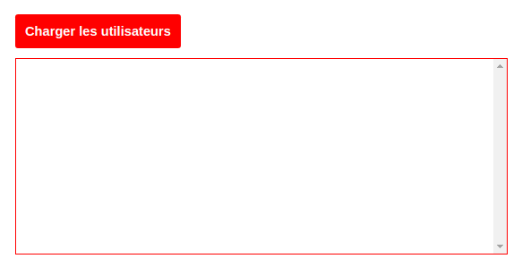

# UserParty

La demande est courte et concise : Nous devons afficher les utilisateurs d'une plateforme sous forme de liste sans recharger la page courante (ce petit module sera sûrement intégré dans une page plus complexe plus tard).

## Instructions

### Données

Les données se trouvent sur ce site... on nous parle d'API :scream:

`http://jsonplaceholder.typicode.com/`

Bon, visiblement il y a de la doc :relaxed: :tada:

- Découvrir l'API
- Trouver comment récupérer les utilisateurs

### Application

Faire en sorte de charger la liste des utilisateurs par l’intermédiaire d'AJAX en se servant de jQuery.

- Organiser l'application à partir de la structure fournie
- Réaliser l'intégration
- Coder le comportement AJAX
- Modifier le DOM avec les données récupérées depuis l'API
- Afficher le nom de l'utilisateur et son entreprise sous forme de listing

## BONUS

Tant qu'on y est... :D

L'API propose bcp de possibilités, il serait intéressant de proposer des fonctionnalités supplémentaires

Servez vous de votre imagination, par exemple :

- Afficher un listing des emails perso des utilisateurs
- Présenter des fiches individuelles présentant adresse personelle et numéro de téléphone

Il est même possible de regarder les autres données disponible comme les posts de blogs ou les commentaires, etc...
